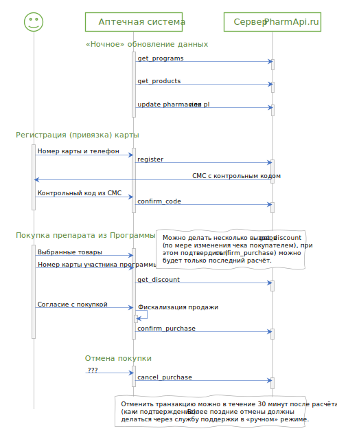

# Последовательность работ при интеграции

## Определение объема доработок :id=scope

Каждая аптечная учетная система уникальна, каждая дисконтная программа уникальна, во многих случаях можно сократить объем работ по интеграции если не реализовывать неиспользуемые функции.

Техническим специалистам аптеки необходимо ознакомиться с условиями запускаемой дисконтной программы и принять решение по следующим вопросам:

1. Будет ли реализовываться регистрация (привязка к телефону владельца) карт на кассе? Если нет, то можно не реализовывать работу с методами `register`  и `confirm_code`.
2. Нужно ли кассовому ПО аптеки регулярно актуализировать "извне" (с сервера pharmapi.ru) сведения о дисконтной программе (код, название, перечень участвующих препаратов)? Если нет, то можно не реализовывать работу с методами `get_programs` и `get_products`, а внести необходимые настройки в информационную систему аптечной сети вручную.
3. Есть ли на кассах возможность оперативного (в течение 15-30 минут после продажи) возврата товара, разрешают ли действующие политики организации такую операцию? Если нет, то можно не реализовывать работу с методом `cancel_purchase`.
4. Много ли аптек в аптечной сети, как часто меняются данные об аптеках (адрес, часы работы)? Если аптек немного (до 20), и данные меняются редко (раз в квартал), то можно (по отдельному согласованию) не реализовывать методы по передаче данных об аптеках ([`update_pharmacies`](changes?id=pharmacies) и/или [`pl`](changes?id=xml_pl)).
5. Есть ли у аптеки обязательства регулярно предоставлять данные об остатках и ценах, или о покупках препаратов из программы без скидок? Если нет, то можно не реализовывать соответствующие методы ([`update_prices`](/methods/update_prices.md) и [`sellout`](/methods/sellout.md)).

## Общая схема работы :id=sequence

Взаимодействие с сервером можно разделить на две части:

1. Фоновые операции (получение информации о программе, синхронизация данных аптек) - должны делаться регулярно, автоматически, однако можно выполнять их в ночные часы в периоды минимальной загруженности систем.
2. Регистрация карты, расчет и предоставление скидки - выполняются в момент продажи акционного товара, важно обслужить покупателя как можно скорее, без задержек;

Схему работы кассового ПО можно представить следующей схемой:

## Типовое техническое задание для доработки информационной системы в аптеке

1. Общие требования:
   1. Все нижеописанные действия (в первою очередь настройка системы) должны быть реализованы в пользовательском интерфейсе учётной/кассовой системы и доступны рядовым пользователям системы (с соответствующими правами), без необходимости  привлечения программистов и без необходимости обновления программного кода системы;
   2. Взаимодействие с сервером должно делаться по имени сервера, так как IP-адрес может меняться в произвольные моменты времени;
   3. Параметр `pharmacy_id` является обязательным, даже если в описании конкретного метода сказано что он опциональный;
2. Реализовать возможность настройки системы под условия дисконтной программы без привлечения программистов:
   1. Должно быть возможно задать "формат" номера карты (длина номера, префикс (первые цифры)), по которому касса должна понимать что необходимо обратиться на внешний сервер для расчета скидки по текущему чеку;
   2. Должно быть можно задать несколько форматов карт одновременно;
   3. Должно быть можно настроить режим/частоту выгрузки остатков аптек (общая выгрузка для всех дисконтных программ);
   4. Должно быть можно настроить режим/частоту выгрузки продаж из каждой аптеки (общая выгрузка для всех дисконтных программ);
3. Расчёт скидки на кассе:
   1. Расчёт должен срабатывать автоматически при добавлении в чек карты, подходящий под один из заданных форматов;
   2. Номер карты должно быть можно как считать с помощью сканера штрихкода (линейный ШК типа Code128), так и ввести вручную с клавиатуры;
   3. Для расчёта скидки необходимо сделать запрос по методу [`get_discount`](/methods/get_discount.md), дождаться ответа и применить результат к текущему чеку; 
       * Необходимо выводить на экран для провизора не только ""разрешенные" размеры скидки, но и сообщения о причинах отсутствия скидки, возвращенные сервером (см. описание метода)
   4. В случае изменения состава чека необходимо автоматически очистить результаты прошлого расчёта и снова вызвать метод `get_discount`, передав обновленное содержимое чека;
   5. Скидка может предоставлена только на целые упаковки. Необходимо запретить добавление в тот же чек товаров в разделенной упаковке, либо же программно исключить их из передачи на сервер;
   6. После пробития чека на фискальном регистраторе необходимо вызвать метод [`confirm_purchase`](/methods/confirm_purchase.md) для фиксации факта продажи на сервере Оператора;
       * В случае технических проблем при вызове метода `confirm_purchase` необходимо повторить вызов метода позже в фоновом режиме, однако не позднее 30 минут с момента вызова `get_discount` (рекомендуется делать несколько попыток, постепенно увеличивая интервал, от 30 секунд до пяти минут);
       * Если повторные попытки вызова `confirm_purchase` также окончатся неудачно - необходимо отобразить этот факт в учетной системе и сигнализировать пользователю, чтобы он мог сформировать обращение в техническую поддержку Оператора в ручном режиме.
   7. В случае, если в кассовом ПО предусмотрен режим отмены покупки (в течение 30 минут после пробития), то необходимо реализовать вызов метода [`cancel_purchase`](/methods/cancel_purchase.md) для передачи этой информации на сервер Оператора.
       * Если кассовое ПО допускает отмену покупки в более поздние сроки, то необходимо отображать факт совершенной отмены в учетной системе и сигнализировать пользователю, чтобы он мог сформировать обращение в техническую поддержку Оператора в ручном режиме.
   8. Запрещено сохранять состояние проверенной карты (активна/неактивна) и применять его к последующим чекам - для каждого чека необходимо делать собственные запросы;
   9. Запрещено "выборочно" применять скидки к чеку, запрещено "экстраполировать" размеры скидки на другое количество препаратов (и в сторону увеличения, и в сторону уменьшения) - расчёт действителен только для того состава чека, который был передан серверу в методе `get_discount`;
4. Выгрузка остатков:
   1. Выгрузка должна делаться автоматически и регулярно, вызовом метода [`update_prices`](/methods/update_prices.md);
   2. Можно выгружать полный ассортимент аптеки или только препараты входящие в программу;
       * Можно получать "препараты входящие в программу" автоматически методом [`get_products`](/methods/get_products.md) или задавать в настройках кассы (должно быть доступно пользователям, без участия программиста)
       * Список препаратов един для всех аптек сети (результат работы метода не зависит от кода переданной аптеки);
5. Выгрузка продаж:
   1. Выгрузка должна делаться автоматически и регулярно, вызовом метода [`sellout`](/methods/sellout.md);
   2. Должны выгружаться и продажи со скидкой (по программе), и продажи без скидки (тех же препаратов из программы, т.е. продажи которые по какой-либо причине были совершены без скидки)
   3. Список препаратов - аналогичен списку препаратов для выгрузки остатков;
6. Отчетность:
   1. В конце расчётного периода (обычно месяц) Оператор сам формирует необходимые закрывающие документы для аптеки, однако аптеке необходимо их с чем-то сверить;
   2. Необходим отчет, где пользователь может увидеть за заданный период все совершенные продажи со скидкой по программе (с детализацией до строки чека);
   3. По каждой продаже необходимо выводить как минимум: дату и время продажи, аптеку (код, адрес), номер карты, наименование препарата, цена, количество, сумма скидки, сумма к оплате, код подтверждения (тот что отдавался в метод `confirm_purchase`);
   4. Если возможности учетной системы позволяют суммировать в одном чеке разные скидки по одним и тем же товарным позициям, то необходимо выводить в отчете отдельно размер скидки по программе и отдельно размер скидки по другим скидочным условиям аптеки;
   5. Отчет (данные из него) должны быть можно выгрузить/сохранить в табличный файл MS Excel;
7. Тестирование и проверка:
   1. Необходимо выполнить тесты описанные в разделе [Типовой сценарий тестирования](/test-cases.md) на тест-сервере, и прислать результаты. После проверки будет открыт доступ к продакшн-серверам. 
