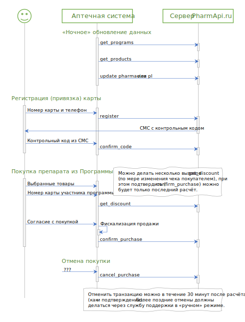

# Последовательность работ при интеграции

## Определение объема доработок :id=scope

Каждая аптечная учетная система уникальна, каждая дисконтная программа уникальна, во многих случаях можно сократить объем работ по интеграции если не реализовывать неиспользуемые функции.

Техническим специалистам аптеки необходимо ознакомиться с условиями запускаемой дисконтной программы и принять решение по следующим вопросам:

1. Будет ли реализовываться регистрация (привязка к телефону владельца) карт на кассе? Если нет, то можно не реализовывать работу с методами `register`  и `confirm_code`.
2. Нужно ли кассовому ПО аптеки регулярно актуализировать "извне" (с сервера pharmapi.ru) сведения о дисконтной программе (код, название, перечень участвующих препаратов)? Если нет, то можно не реализовывать работу с методами `get_programs` и `get_products`, а внести необходимые настройки в информационную систему аптечной сети вручную.
3. Есть ли на кассах возможность оперативного (в течение 15-30 минут после продажи) возврата товара, разрешают ли действующие политики организации такую операцию? Если нет, то можно не реализовывать работу с методом `cancel_purchase`.
4. Много ли аптек в аптечной сети, как часто меняются данные об аптеках (адрес, часы работы)? Если аптек немного (до 20), и данные меняются редко (раз в квартал), то можно (по отдельному согласованию) не реализовывать методы по передаче данных об аптеках ([`update_pharmacies`](changes?id=pharmacies) и/или [`pl`](changes?id=xml_pl)).

## Общая схема работы :id=sequence

Взаимодействие с сервером можно разделить на две части:

1. Фоновые операции (получение информации о программе, синхронизация данных аптек) - должны делаться регулярно, автоматически, однако можно выполнять их в ночные часы в периоды минимальной загруженности систем.
2. Регистрация карты, расчет и предоставление скидки - выполняются в момент продажи акционного товара, важно обслужить покупателя как можно скорее, без задержек;

Схему работы кассового ПО можно представить следующей схемой:

